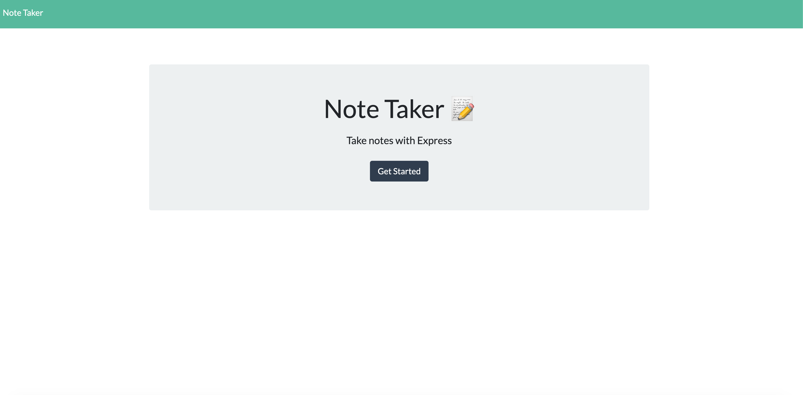
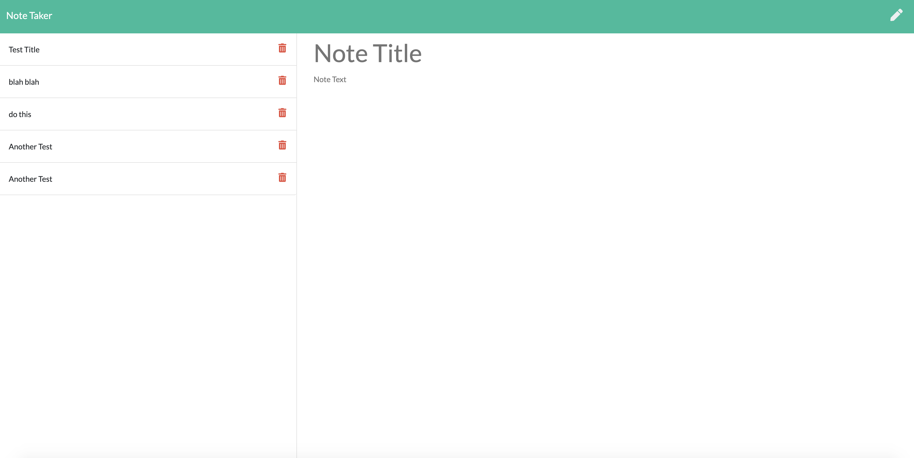

# Note Taker

[](https://opensource.org/licenses/MIT)

## Description

A note taking application that allows

## Table of Contents

- [Note Taker](#note-taker)
  - [Description](#description)
  - [Table of Contents](#table-of-contents)
  - [User Story](#user-story)
  - [Acceptance Criteria](#acceptance-criteria)
  - [Usage](#usage)
  - [Built With](#built-with)
  - [License](#license)
  - [Contributing](#contributing)
  - [Testing](#testing)
  - [Contact](#contact)

## User Story

```
AS A user, I want to be able to write and save notes

I WANT to be able to delete notes I've written before

SO THAT I can organize my thoughts and keep track of tasks I need to complete
```

## Acceptance Criteria

```
Application should allow users to create and save notes.

Application should allow users to view previously saved notes.

Application should allow users to delete previously saved notes.
```

## Usage

View the deployed heroku application [here](https://warm-bayou-36809.herokuapp.com/).





## Built With

- node.js
- express
- uuid

## License

[MIT](LICENSE)

## Contributing

To contribute to this project create a branch with the feature or correction then submit a pull request.

## Testing

No tests have been created for this application at this time.

## Contact

Please direct any questions or concerns directly to me via my email address listed below.

- Github: [relizabet](https://github.com/relizabet)
- Email: rachel@relizabeth.com
